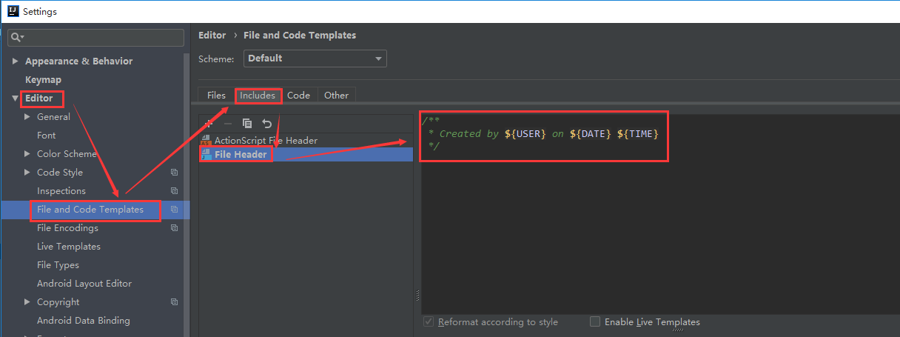

# IntelliJ IDEA如何设置新建类时，自动注释作者信息和日期时间

**本文提供两种注释风格供参考。**

 

**风格1：简约Style**

效果如下：


 

设置步骤：

File--> Settings--> Editor--> File and Code Templates--> Includes--> File Header--> "添加以下代码"




 

添加如下代码（此处的${USER}会读取个人PC的用户名）：

```
/**
 * Created by ${USER} on ${DATE} ${TIME}
 */
```

 

如果想指定作者名称（比如：Miracle Luna），可以用以下代码：

```
/**
 * Created by Miracle Luna on ${DATE} ${TIME}
 */
```

此时效果如下：


 

 

 

**风格2：官方Style**

效果如下：


 

 

设置步骤：

File--> Settings--> Editor--> File and Code Templates--> Includes--> File Header--> "添加以下代码"


 

 

添加如下代码（此处的${USER}会读取个人PC的用户名）：

```
/**
 * @Author ${USER}
 * @Date ${DATE} ${TIME}
 * @Version 1.0
 */
```

 

如果想指定作者名称（比如：Miracle Luna），可以用以下代码：

```
/**
 * @Author Miracle Luna
 * @Date ${DATE} ${TIME}
 * @Version 1.0
 */
```

此时效果如下：


 

 **总结**

以上是两种设置风格。喜欢哪种style？简约风？还是官方风？ ^_^